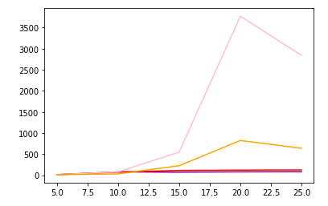

<h1 align="center">8 Puzzle</h1>

<h4 align="center"> 
	Concluído ✔️
</h4>

---

   <h2 align="center">Tópicos 📋</h2>

   <p>
   
   - [Sobre 📖](#sobre-)
   - [Funcionalidades 🛠️](#funcionalidades-%EF%B8%8F)
   - [Tecnologias 📲](#tecnologias-)
   - [Gráfico 🏁](#grafico-)
   - [Como utilizar 🤔](#como-utilizar-)

   </p>

---

<h2 align="center">Sobre 📖</h2>
   
<p align="center">
  Software desenvolvido com python com o intuito de resolver o problema do jogo 8 puzzle, através de dois diferentes algoritmos e comparando o desempenho dos mesmos no final.
</p>

---

<h2 align="center">Funcionalidades 🛠️</h2>

   <p>

- Escolher a disposição dos números no jogo
- Resolver o problema através do algoritmo Hill Climbing
- Resolver o problema através do algoritmo A*
- Escolher a heuristíca utilizando distância de manhattan
- Escolher a heurística que soma para cada número na posição errada
- Ver o gráfico que compara o número de nós de todos os algoritmos/heurísticas

   </p>

---

<h2 align="center">Tecnologias 📲</h2>

   <p>

-   **[PYTHON](https://www.python.org)**
-   **[COPY](https://docs.python.org/3/library/copy.html)**
-   **[MATPLOTLIB](https://matplotlib.org)**

   </p>

---

<h2 align="center">Gráfico 🏁</h2>

<div align = "center">
   <p>

- O gráfico da Heurística 1(Hill Climbing) é representado pela cor roxo
- O gráfico da Heurística 2(Hill Climbing) é representado pela cor vermelho
- O gráfico da Heurística 2(A*) é representado pela cor rosa
- O gráfico da Heurística 2(A*) é representado pela cor laranja

   </p>
</div>
   
<div align = "center"></div>

---

<h2 align="center">Como utilizar 🤔</h2>

   ```
   É só utilizar o link do Colab 😉
   
   [COLAB](https://colab.research.google.com/github/icarogga/8puzzle/blob/main/8puzzle.ipynb)**
   ```

---

## 💪 Como contribuir para o projeto

1. Faça um **fork** do projeto.
2. Crie uma nova branch com as suas alterações: `git checkout -b my-feature`
3. Salve as alterações e crie uma mensagem de commit contando o que você fez: `git commit -m "feature: My new feature"`
4. Envie as suas alterações: `git push origin my-feature`
> Caso tenha alguma dúvida confira este [guia de como contribuir no GitHub](./CONTRIBUTING.md)

---

   ## 🦸 Autor

   Este projeto foi desenvolvido com o ❤️ por **[@Ícaro Coêlho](https://github.com/icarogga?tab=following)** 👋🏽 Entre em contato!
   
   [](https://www.linkedin.com/in/ícaro-coelho-3a5b60206/) 
[](mailto:icarogga@gmail.com)

---

## 📝 Licença

Este projeto esta sobe a licença [MIT](./LICENSE).


---

